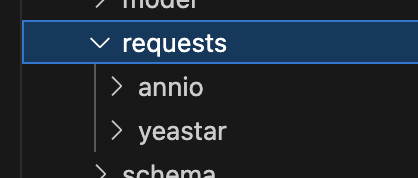
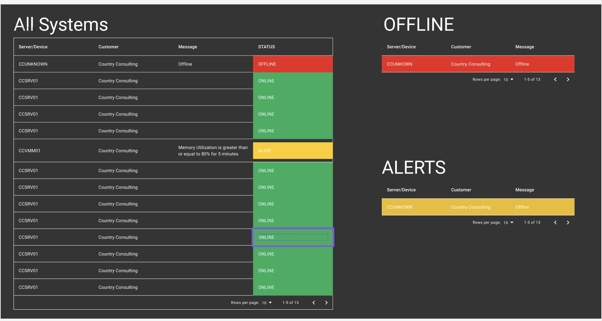

# Ninja One API & Web Hook Feasibility Assessment
Feasibility of creating a systems sashboard using Ninja Ones APIs and Web Hooks.

## Available APIs
There are a number of endpoints available that can provide sufficient data to construct a basic table for systems monitoring.

Here are some endpoints that we can use for this purpose:

### `GET api/v2/devices`

This returns a list of all Devices and can be used to construct the initial device list in the table. Example of an item in the response:
```JSON
[
    {
        "id": 7,
        "parentDeviceId": 6,
        "organizationId": 2,
        "locationId": 2,
        "nodeClass": "VMWARE_VM_HOST",
        "nodeRoleId": 9,
        "rolePolicyId": 43,
        "approvalStatus": "APPROVED",
        "offline": false,
        "displayName": "192.168.50.43",
        "systemName": "ccesxi03.cc.local",
        "dnsName": "192.168.50.43",
        "created": 1707363433.892432000,
        "lastContact": 1742412252.744000000,
        "lastUpdate": 1742412252.744000000
    },
]
```

### `GET /api/v2/queries/device-health`
A list of Device statuses can be used to apply the device status to the pre-established list of devices on initial load or opening of the monitoring dashboard.
```JSON
{
    "results": [
        {
            "activeThreatsCount": 0,
            "quarantinedThreatsCount": 0,
            "blockedThreatsCount": 0,
            "failedOSPatchesCount": 0,
            "pendingOSPatchesCount": 0,
            "alertCount": 0,
            "activeJobCount": 0,
            "failedSoftwarePatchesCount": 0,
            "pendingSoftwarePatchesCount": 0,
            "pendingRebootReason": "WINDOWS_PM",
            "productsInstallationStatuses": {},
            "offline": true,
            "parentOffline": false,
            "healthStatus": "NEEDS_ATTENTION",
            "installationIssuesCount": 0,
            "deviceId": 63
        },
        ...
    ]
}
```

### `GET /api/v2/device/:id`
Individual devices can be queried for additional information if additional info is required for display upon an error or alert.
```JSON
{
    "id": 7,
    "parentDeviceId": 6,
    "organizationId": 2,
    "locationId": 2,
    "nodeClass": "VMWARE_VM_HOST",
    "nodeRoleId": 9,
    "rolePolicyId": 43,
    "approvalStatus": "APPROVED",
    "offline": false,
    "displayName": "192.168.50.43",
    "systemName": "ccesxi03.cc.local",
    "dnsName": "192.168.50.43",
    "created": 1707363433.892432000,
    "lastContact": 1742412689.092000000,
    "lastUpdate": 1742412689.092000000,
    "ipAddresses": [
        "192.168.50.43",
        "fe80::d267:26ff:fecb:352"
    ],
    "macAddresses": [
        "d0:67:26:cb:03:52",
        "d0:67:26:cb:03:52",
        "d0:67:26:cb:03:55",
        "d0:67:26:cb:03:54",
        "d0:67:26:cb:03:53"
    ],
    "cpuMhz": 2195,
    "cpuModel": "Intel(R) Xeon(R) Silver 4114 CPU @ 2.20GHz",
    "htActive": true,
    "htAvailable": true,
    "lastBootTime": 1741071104.000000000,
    "memorySize": 102715461632,
    "model": "ProLiant DL380 Gen10",
    "name": "ccesxi03.cc.local",
    "cpuPackages": 2,
    "cpuThreads": 40,
    "serviceTag": "SGH811YWCM",
    "vendor": "HPE",
    "releaseName": "VMware ESXi 8.0.1 build-21813344",
    "version": "8.0.1",
    "buildNumber": "21813344",
    "deviceType": "VMHost"
}
```

### `GET /api/v2/alerts`
This displays only the active alerts and can be used to populate additional inormation in the dable when displaying alerts. This would only be used on Dashboard opening as Web hooks would handle the automatic updates. (See the next section for Web Hooks)
```JSON
[
    {
        "uid": "50edcf11-de92-4ecb-955b-c8066488b6cc",
        "deviceId": 33,
        "message": "EventId: 41, EventTime: 2024-10-30T23:49:52Z, Source: Microsoft-Windows-Kernel-Power, Message: The system has rebooted without cleanly shutting down first. This error could be caused if the system stopped responding, crashed, or lost power unexpectedly.",
        "createTime": 1730332915.000000000,
        "updateTime": 1730332915.000000000,
        "sourceType": "CONDITION_WINDOWS_EVENT_LOG_TRIGGERED",
        "sourceConfigUid": "cae74b14-cac8-4c35-8dea-f6ed59622602",
        "sourceName": "",
        "subject": "41",
        "data": {
            "message": {
                "code": "agent_cond_eventlog2",
                "params": {
                    "event_id": "41",
                    "event_time": "2024-10-30T23:49:52Z",
                    "event_source": "Microsoft-Windows-Kernel-Power",
                    "msg": "The system has rebooted without cleanly shutting down first. This error could be caused if the system stopped responding, crashed, or lost power unexpectedly."
                }
            }
        }
    },
    ...
]
```

## Web Hooks
The Ninja One dashboard will send a 'POST' request to our server when the status of any of the systems change. A current web hook is set up for testing purposes and the data that would be received to our server can be viewed here live: [Webhook.site](https://webhook.site/#!/view/a0385642-4a38-430d-a9c2-6b28d8f55a3b/5ea1ee98-6906-4e67-ae8f-2c1f7c31ac2c/1)

We would use this data to update information on Dashboard as it comes in real time.

Example of data received by our server:
```JSON
{
  "id": 177210,
  "activityTime": 1742391675.556,
  "deviceId": 7,
  "seriesUid": "e6b0b0bd-5753-445d-9e4a-71c08983cbd5",
  "activityType": "CONDITION",
  "statusCode": "TRIGGERED",
  "status": "Triggered",
  "sourceConfigUid": "205b85b2-8a12-4123-834f-164be08b3314",
  "sourceName": "_average_",
  "subject": "",
  "message": "Memory Utilization is greater than or equal to 80% for 5 minutes",
  "type": "Condition",
  "data": {
    "message": {
      "code": "vmm_cond_memory_usage_ge",
      "params": {
        "duration": 5,
        "end_date": 1742391675556,
        "start_date": 1742391365182,
        "target": "_average_",
        "threshold": 80,
        "unit": "%",
        "value": 84.80957683284261
      }
    }
  },
  "device": {
    "id": 7,
    "parentDeviceId": 6,
    "organizationId": 2,
    "locationId": 2,
    "nodeClass": "VMWARE_VM_HOST",
    "nodeRoleId": 9,
    "rolePolicyId": 43,
    "approvalStatus": "APPROVED",
    "offline": false,
    "displayName": "192.168.50.43",
    "systemName": "ccesxi03.cc.local",
    "dnsName": "192.168.50.43",
    "created": 1707363433.892432,
    "lastContact": 1741793638.531,
    "lastUpdate": 1741793638.531,
    "references": {
      "organization": {
        "name": "Country Consulting",
        "nodeApprovalMode": "AUTOMATIC",
        "id": 2
      },
      "location": {
        "name": "Main Office",
        "id": 2
      }
    }
  }
}
```

## Building the dashboard
We can continue to use the Annio integration server to serve the dashboard and handle the API Authentication and requests. The Dashboard would be build using react frontend and the backend would be the existing integration server.

This server has been designed to integrate API's from multiple services (Including Annio). This setup would avoid running a new lightsail instance (Saving Money), and allows for pre-configured integration of Ninja One into Annio via the integration server (If we decide to persue this in the future).

Yeastar and Annio API's have already been integrated into the Annio integrations server here:


A quick mock up based on the data available from the API's and WebHooks listed above:
